> **Disclaimer:**  
> This document is based on anonymized technical document originally prepared for a client.  
> All company names, proprietary features, and sensitive data have been replaced with generic placeholders.  
> It is intended solely as a writing sample to demonstrate technical documentation skills.

---

# **Webhooks Feature Quick Start Guide**

## **Table of contents**
- [**Webhooks Feature Quick Start Guide**](#webhooks-feature-quick-start-guide)
  - [**Table of contents**](#table-of-contents)
  - [**Document version history**](#document-version-history)
  - [**Introduction**](#introduction)
  - [**Webhooks: purpose and benefits** {#webhooks-purpose-and-benefits}](#webhooks-purpose-and-benefits-webhooks-purpose-and-benefits)
    - [What is a webhook?](#what-is-a-webhook)
    - [Example payload](#example-payload)
  - [**Difference between API and webhook**](#difference-between-api-and-webhook)
  - [**Prerequisites**](#prerequisites)
  - [**Limitations**](#limitations)
  - [**Creating webhooks**](#creating-webhooks)
  - [**Verifying webhook operation**](#verifying-webhook-operation)
    - [Logging out of **\[PLATFORM\]**](#logging-out-of-platform)
    - [Checking webhook event](#checking-webhook-event)
  - [**Managing webhooks**](#managing-webhooks)
    - [Editing webhook](#editing-webhook)
    - [Disabling webhook](#disabling-webhook)
    - [Deleting webhook](#deleting-webhook)


## **Document version history**
| Version | Modified by | Modifications | Date | Status |
| :---: | :---: | ----- | :---: | :---: |
| 1.0 | **[PLATFORM]** | Initial release | Apr 2022 | Expired |
| 1.1 | **[PLATFORM]** | Updated to reflect UI/UX changes | Dec 2025 | Expired |
| 1.2 | **[PLATFORM]** | Added new content lifecycle events (`content.created`, `content.updated`, `content.deleted`) | Jul 2026 | Active |

---

## **Introduction**
This document is designed for administrators who need to track how users within their organizations interact with the **[PLATFORM]**.

---

## **Webhooks: purpose and benefits** {#webhooks-purpose-and-benefits}

### What is a webhook?
Webhooks are **automated messages generated and sent by the platform upon certain events**. They function like push notifications delivered to a client‑specified recipient (application, file, database, or server).  

A webhook contains a **payload** and is sent to a predefined unique URL.

### Example payload
```json
{
  "payload": {
    "accountId": "[account_id]",
    "action": "USER.SIGN_OUT",
    "actorUser": {
      "email": "user@example.com",
      "fullName": "Sample User",
      "id": "[id]"
    },
    "createdAt": "2022-04-05T14:53:00.358Z",
    "id": "[ID]"
  }
}
```
Webhooks are faster and more efficient than polling APIs. They allow external systems to stay in sync with platform events in real time.

## **Difference between API and webhook**
Webhook → Event‑based. Data is pushed automatically when an event occurs.

API → Request‑based. You must send a request to retrieve data.

In short: _webhooks deliver data, APIs request data_.

## **Prerequisites**
To use the **Webhooks** feature:

1. Ensure the **Audit Log** feature is included in your subscription plan.

2. Confirm your user has **Admin** permissions. If you are able to get to the **[PLATFORM]** **Admin panel**, it means your user has the **Admin** permissions.
<div align="center">
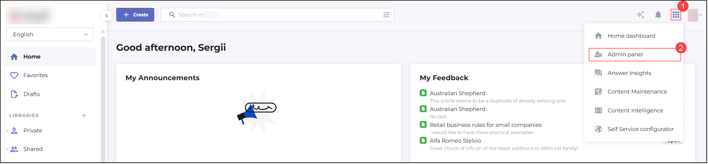
<p><em>Figure 1. Accessing Admin panel</em></p>
</div>

3. Verify the **Audit Log** option is enabled in the **Customize** submenu.
<div align="center">
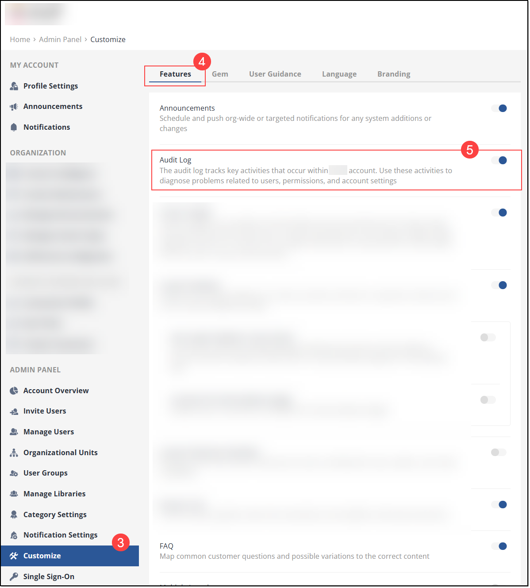
<p><em>Figure 2. Enabling Audit Log</em></p>
</div>

4. Configure your server and endpoint to properly receive webhook messages.

If all the above preconditions are met, you can now start working with the **[PLATFORM]** **Webhooks** feature. Jump to the below sections to find out which actions you can do on webhooks.

## **Limitations**

In addition to the prerequisites, an efficient use of the **[PLATFORM]** **Webhooks** feature has certain restrictions, which are as follows:

* Not more than **5 (five) unique webhooks** can be created from the **Manage Webhooks** submenu.

* One webhook can contain **no more than 11 (eleven) internal **[PLATFORM]** events.**

* Your webhook endpoint is expected to respond with the HTTP status **2xx** in **5 seconds** **or less**. If the response is sent outside this timeframe, the webhook payload delivery is considered as failed. From our side, **[PLATFORM]** retries sending failed payloads for up to **3 times**.

☝ **NOTE:** *Newly added content events (`content.created`, `content.updated`, `content.deleted`) are not enabled automatically for your existing webhooks. To start receiving them, edit the relevant webhook and select the required events in the **Events to send** section.*

## **Creating webhooks**
To create a webhook:

1. Navigate to **Manage Webhooks** in the **Admin panel**.
<div align="center">
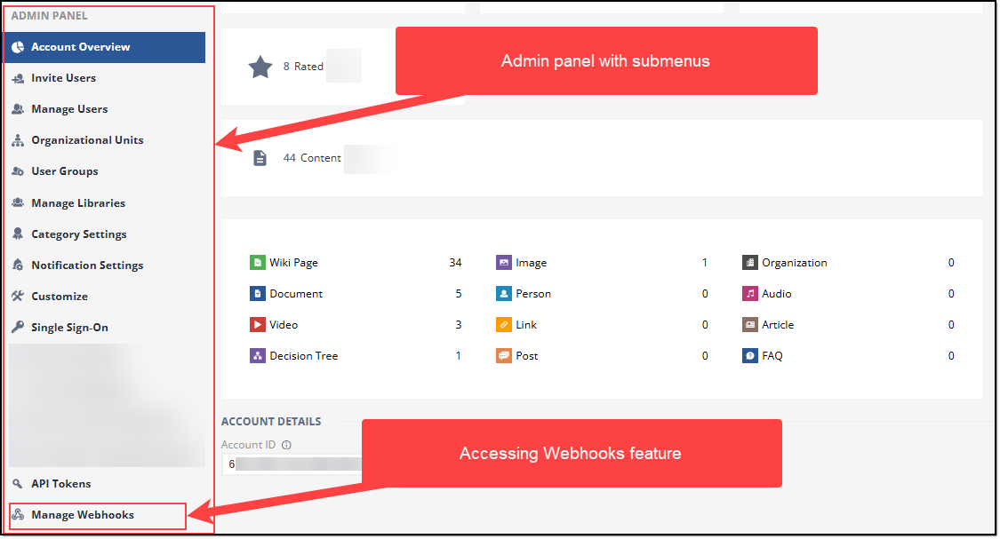
<p><em>Figure 3. Accessing Webhooks feature</em></p>
</div>

2. On the **Manage Webhooks** page that opens, сlick **Add webhook**.
<div align="center">
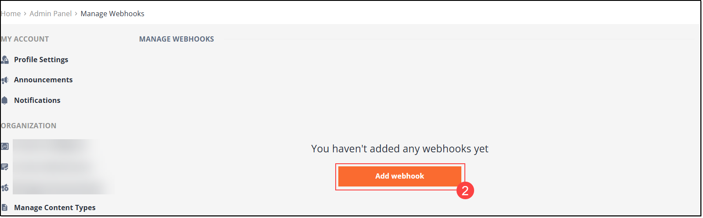
<p><em>Figure 4. Adding webhook</em></p>
</div>

3. In the **ADD WEBHOOK** form that opens, fill in the required fields as described in the table below:
   
<a id="table-1"></a>
**Table 1\. ADD WEBHOOK form elements**

| Element name | Requirement | Details |
| :---: | :---: | ----- |
| **Webhook name** | Mandatory | Enter any desired name of the webhook; max length must **not exceed 60 characters**.  |
| **Status** | Mandatory | This element has two states represented by the checkboxes: **Disabled**: your webhook configuration is saved, but it’s not being triggered after creation. **Enabled**: the webhook configuration is saved and it becomes triggered as soon as the new event arrives. |
| **Endpoint URL** | Mandatory | Enter an URL address of an endpoint to which **[PLATFORM]** is expected to send events in case new users are created in the system. The indicated endpoint URL must be capable of accepting POST HTTPS requests. <br> ☝***NOTE**: For the purpose of future verification of the webhook operation, we use [https://webhook.site](https://webhook.site) as a service that helps check and verify webhooks. When you open this link in your browser, you are offered to copy the endpoint URL you can use for your webhook testing. In our case, this endpoint URL is [https://webhook.site/webhook-id](https://webhook.site/webhook-id). In a real-world scenario, use the endpoint URL offered by your dedicated server.*  |
| **Description** | Optional | In this text field, enter any description for your webhook. It should **not exceed 500 characters**. |
| **Events to send** | Required | This element is where you need to select from **1 to 11** types of conditions that are to generate events to be sent to the specified endpoint.  The available condition types are: <br> - **`user.sign_in_success`**: An event is expected to be sent upon each successful user sign-in. <br> - **`user.sign_in_failure`**: An event is expected to be sent upon each failed attempt of the user sign-in. The event also shows the reason for a failed sign-in, for example wrong password or too many sign-in attempts. <br> - **`user.sign_out`**: An event is expected to be sent upon each successful user sign-out. <br> - **`user.pwd_changed`**: An event is expected to be sent upon each successful change of a user password. <br> - **`user.account_role_change`**: An event is expected to be sent each time the admin changes the user’s role in **[PLATFORM]**. <br> - **`user.creation`**: An event is expected to be sent upon a successful creation of user profile in **[PLATFORM]**. <br> - **`account.settings_update`**: An event is expected to be sent when the admin updates settings in the user account; currently, the event is triggered only when the admin enables or disables features on the account. <br> - **`document.gaps.updated`**: An event is expected to be sent for notifying about content quality processing progress for external systems. In short: when content is subjected to gap analysis, the system records changes of the relevant gap state, aggregates these changes into document-level events, and sends real-time notifications to the respective subscribed external systems. <br> - **`content.created`**: An event is expected to be sent each time a new content item is created and published in **[PLATFORM]**.  <br> - **`content.updated`**: An event is expected to be sent each time a content item has its title, content, categories, or tags changed. The event includes an `attributesChanged` list that indicates exactly which of these attributes were modified. <br> - **`content.deleted`**: An event is expected to be sent each time a content item is deleted or archived. The event includes the `isArchived` flag that shows whether the content item was archived (`true`) or permanently deleted (`false`).|
| **CANCEL** | N/A | If you no longer need to create a webhook, click this button to stop the procedure and close the form without saving the changes made. |
| **ADD** | N/A | Click this button to finish the webhook creation procedure and save the new webhook. |

> ☝ **NOTE:** *Content events currently apply to **Wiki (Article)** items only. Other content types do not trigger these events. To keep the payload lightweight, content events do not include the article body — use the `contentId` value from the received event to retrieve the full article via the **[PLATFORM]** API in a single follow-up request.*
>
<div align="center">
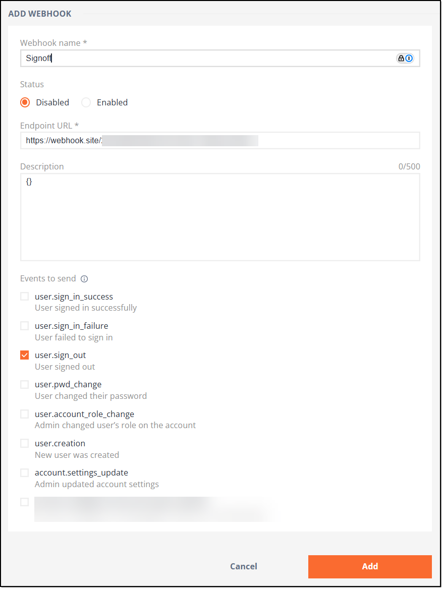
<p><em>Figure 5. Populating webhook form</em></p>
</div>

4. After populating the needed fields and setting the required condition(s), click **Add** to create and save the webhook.
<div align="center">
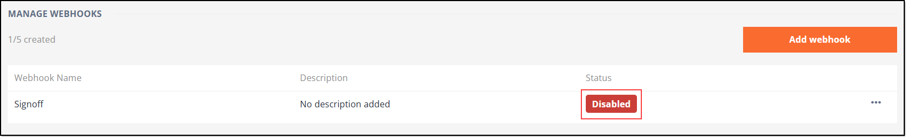
<p><em>Figure 6. Checking webhook creation</em></p>
</div>
 
If you have created the webhook with the **Disabled** status as shown in the figure above, you can enable it by performing the following steps.
<div align="center">
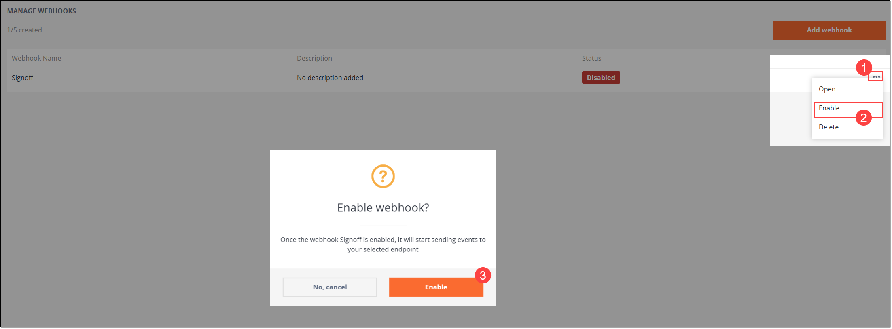
<p><em>Figure 7. Enabling webhook</em></p>
</div>

## **Verifying webhook operation**

Let’s now verify the webhook operation by the example of the user sign-out event. This exemplary verification is needed to show that your managers are able to track activities of their agents. 

☝***NOTE**:*  
*Any of the conditions/events indicated in [Table 1](#table-1) can be used to verify that the webhook you have created is working.*

In order to check if the created webhook is triggered properly - the system creates and sends relevant events to your endpoint - you need to log out of your **[PLATFORM]** account 

### Logging out of **[PLATFORM]**

To log out of your account, perform the following steps.

1) When on the **[PLATFORM]** main page, find and click your user logo in the upper right corner of the window. 

2) In the dropdown menu that appears, select the **Logout** option. 
<div align="center">
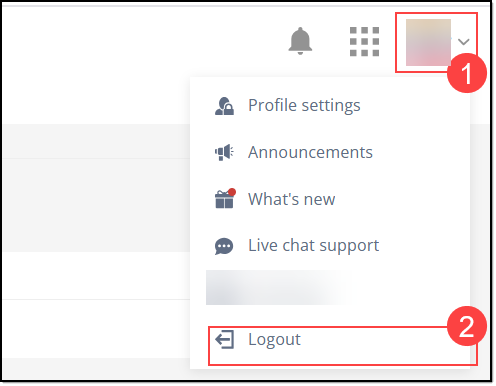
<p><em>Figure 8. Logging out</em></p>
</div>

Once you are logged out, you are redirected to the **[PLATFORM]** login screen.
<div align="center">
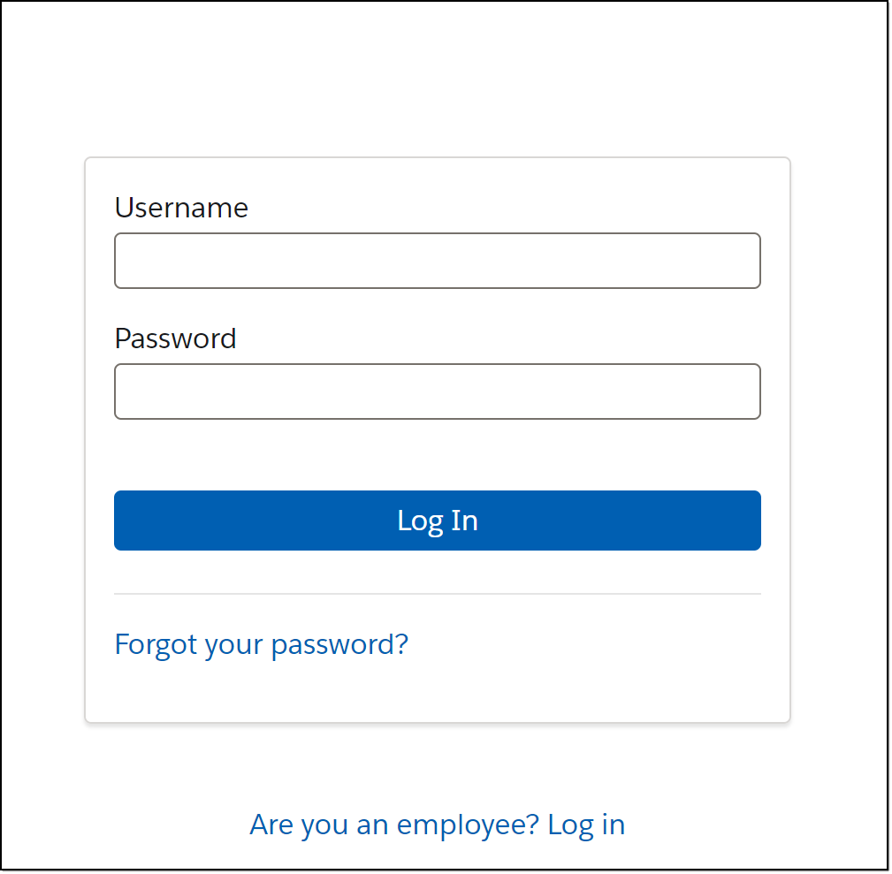
<p><em>Figure 9. Viewing login screen</em></p>
</div>

### Checking webhook event

To make sure that the webhook you have created generates and submits proper events to your endpoint, log in to your server (or database, if applicable) and check if the respective event has been added. 

As mentioned in the Note in [Table 1](#table-1), when creating the webhook, we used the endpoint URL generated by [https://webhook.site](https://webhook.site). This service is also used here in this section to check where the webhook we have previously created triggers proper events. In our case, this event must be triggered by logging out of the user account.

To check if the webhook has triggered and sent the respective event upon the user logout, open the above URL address and see if there is any new record. If there is a new record and if it is about a webhook-triggered event, it must look like this:
<div align="center">
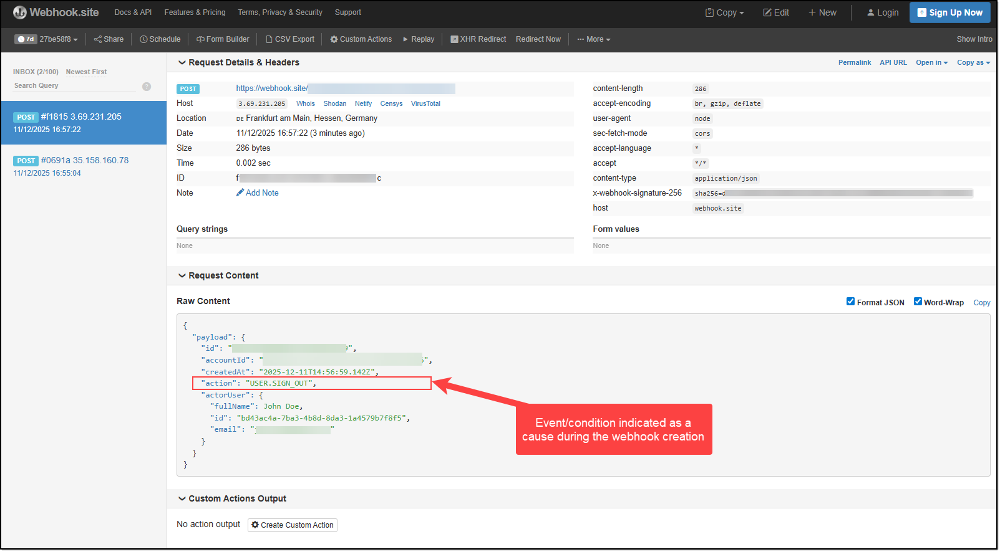
<p><em>Figure 10. Verifying webhook-triggered event</em></p>
</div>

From the figure above, it is obvious the webhook was created and it generated the proper event (**“`USER.SIGN_OUT`”**} on the specified date and at the specified time (**“`2025-12-11T14:56:59.142Z`”**) as a result of the user who is registered under the specified email address logging out of **[PLATFORM]**.

Another example of the webhook operation can be seen when a content item is updated. The content event is created and sent to your endpoint:

```json
{
  "payload": {
    "id": "[ID]",
    "accountId": "[account_id]",
    "createdAt": "2026-07-03T08:49:00.358Z",
    "action": "CONTENT.UPDATED",
    "actorUser": {
      "id": "[id]",
      "email": "john.doe@example.com",
      "fullName": "John Doe"
    },
    "content": {
      "id": "[content_id]",
      "l10n": {
        "lang": "en",
        "isSourceLanguage": true,
        "source": {
          "lang": "en",
          "contentId": "[content_id]"
        }
      }
    },
    "attributesChanged": ["title", "wiki-content"]
  }
}
```

From the example above, it is evident that a Wiki article (content item) identified by the specified `content.id` had its **title** and **content** changed on the specified date and time by the user registered under the specified email address.

> ☝ **NOTE:** *A single article update may occasionally generate more than one `content.updated` event (for example, when the title and the content are processed separately). Each event always includes the `attributesChanged` list, so you can reliably determine what changed and whether a follow-up notification is expected.*

These examples show that the **[PLATFORM]** **Webhooks** feature works as expected and triggers proper events as a result of certain actions.

## **Managing webhooks**

In **[PLATFORM]**, in addition to creating webhooks, it is also possible to manage them. For instance, you can edit webhooks you have previously created, disable them, or even delete. 

☝***NOTE**:*   
*Any webhook you have previously created can be edited, disabled, and/or deleted.*

### Editing webhook

In order to edit the existing webhook, follow the below procedure. 

1) Go to the **MANAGE WEBHOOKS** page by selecting the **Manage Webhooks** submenu in the **Admin panel**. On this page, you can open the webhook that you want to edit either by directly clicking it (a) or by opening the **More actions** menu and selecting the **Open** option (b). 
<div align="center">
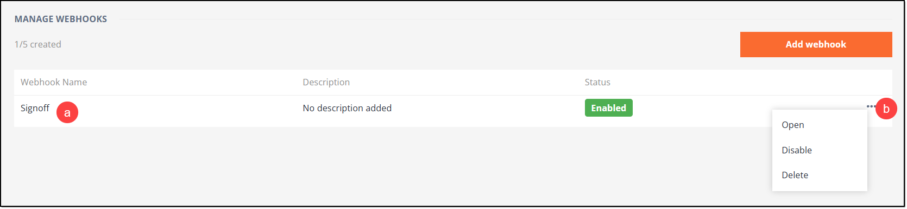
<p><em>Figure 11. Opening webhook for editing</em></p>
</div>

2) Once you get to the **EDIT WEBHOOK** form, you can edit any data you have entered for this webhook at its creation. For more details on the form fields and elements, refer to [Table 1](#table-1) above.   
<div align="center">
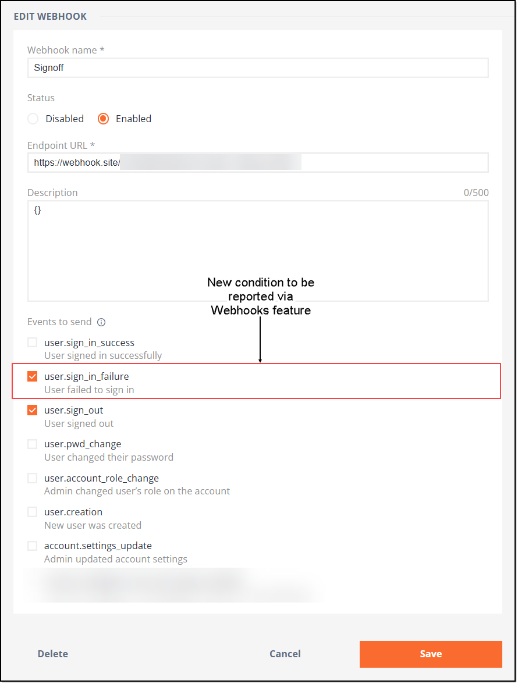
<p><em>Figure 12. Editing webhook</em></p>
</div>

3) Once done with the editing, you can either click **Save** to save the changes made and update the webhook or click **Cancel** to disregard the changes and close the form. In the latter case, the pop-up window appears with the respective warning. If you still want to delete the changes, confirm your choice by clicking **Leave this page**. In that case, the pop-up window closes and the changes made are deleted, and you are redirected to the **MANAGE WEBHOOKS** page. Otherwise, you can click **Stay on this page**, which closes the pop-up window and redirects you to the **EDIT WEBHOOK** form where you can continue making the needed changes.  
<div align="center">
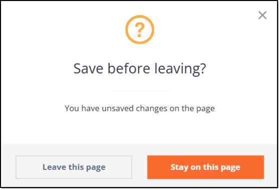
<p><em>Figure 13. Viewing warning notification</em></p>
</div>

### Disabling webhook

At a certain point, any of the previously created webhooks can become unneeded for some time. In that case, you can temporarily disable this webhook by performing the following.

Go to the **MANAGE WEBHOOKS** page and perform one of the below actions:

(**a**) Open the **Actions** menu next to the needed webhook and select the **Disable** option from the list.
<div align="center">
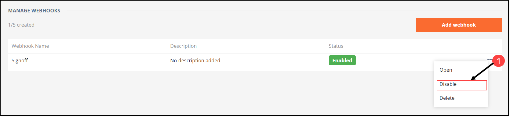
<p><em>Figure 14. Accessing Actions menu and Disable option</em></p>
</div>

Then in the popup that appears, confirm your choice by clicking **Disable**.
<div align="center">
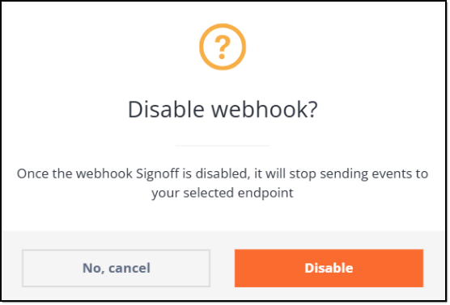
<p><em>Figure 15. Confirming webhook disabling</em></p>
</div>

(**b**) On the **MANAGE WEBHOOKS** page, click the needed webhook to open its **EDIT WEBHOOK** form. Then in this form, change the webhook status to **Disabled** by selecting the respective checkbox.
<div align="center">
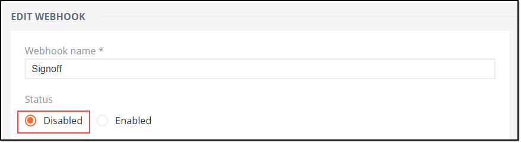
<p><em>Figure 16. Switching webhook status to Disabled</em></p>
</div>

Once the **Disabled** checkbox is selected, click **Save** to confirm. 
<div align="center">
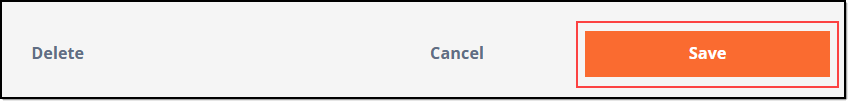
<p><em>Figure 17. Saving disabled webhook</em></p>
</div>

After completing any of the actions described above the webhook status changes to **Disabled**, and you can see the relevant label on the **MANAGE WEBHOOKS** page.
<div align="center">

<p><em>Figure 18. Viewing webhook status</em></p>
</div>

### Deleting webhook

If you no longer need any of the previously created webhooks, you can easily delete them from **[PLATFORM]**. To do so, perform the following.

Go to the **MANAGE WEBHOOKS** page and perform one of the following actions:

1) Open the **More actions** menu next to the needed webhook and select the **Delete** option from the list. 
<div align="center">
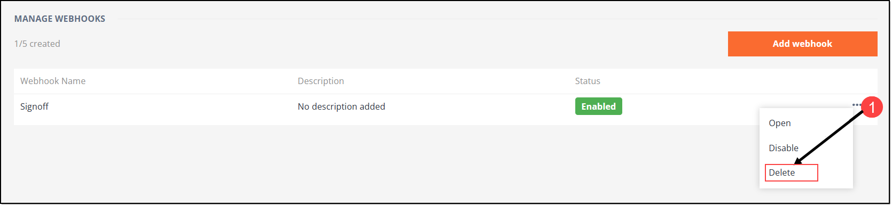
<p><em>Figure 19. Accessing Delete option in Webhook's menu</em></p>
</div>

Then in the popup window that appears, confirm your choice by clicking **Delete**.
<div align="center">
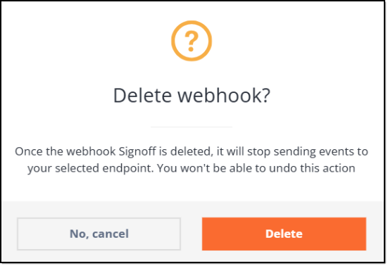
<p><em>Figure 20. Confirming webhook deletion</em></p>
</div>

2) On the **MANAGE WEBHOOKS**  page, click the needed webhook to open its **EDIT WEBHOOK** form. Then in this form, locate and click the **Delete** button. 
<div align="center">
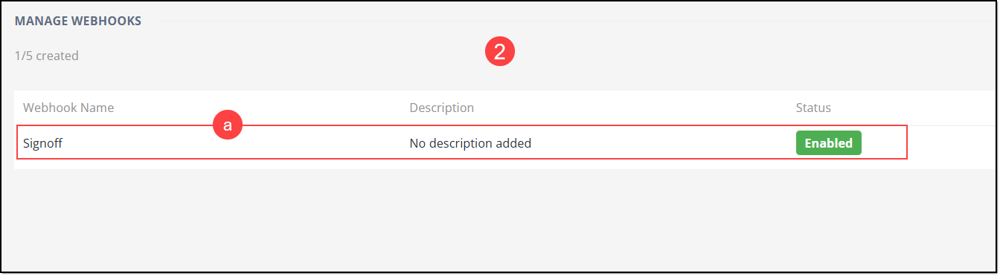
<p><em>Figure 21. Deleting webhook - Access Edit Webhook form</em></p>
</div>
  
<div align="center">
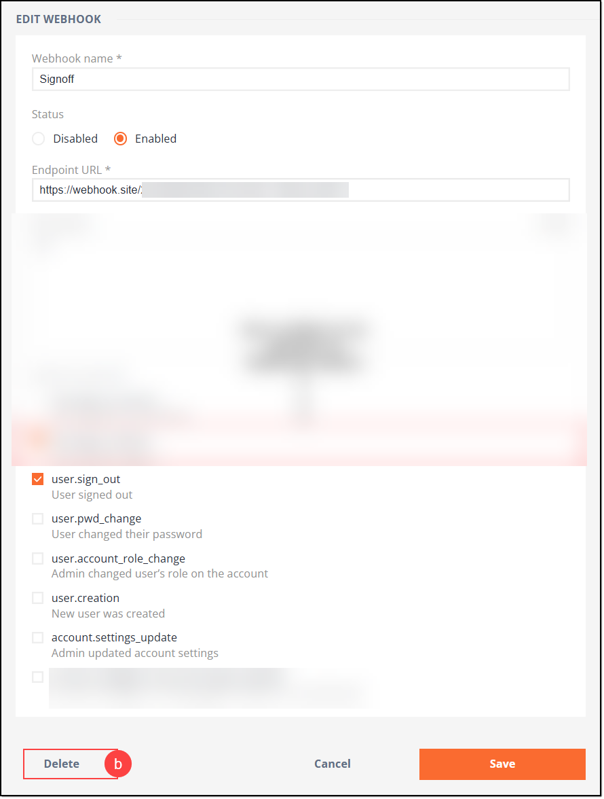
<p><em>Figure 22. Deleting webhook - Clicking Delete</em></p>
</div>

   Then in the popup window that appears, confirm your choice by clicking **Delete** as shown in **Figure 20** above.

No matter what method you use to delete the webhook, once you have clicked the respective button (**Delete**), the webhook is removed.  
<div align="center">
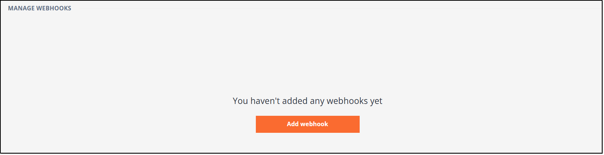
<p><em>Figure 23. Deleting webhook - Verifying webhook deletion</em></p>
</div>

If you have successfully completed the actions described in the sections above, it means that you now understand how the **[PLATFORM]** **Webhooks** feature works and how to create, edit, enable/disable, and delete webhooks.